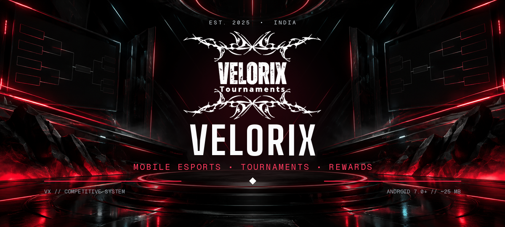

<div align="center">
  

  <br />

  <a href="https://velorix-hub.vercel.app"></a>
  <a href="https://velorix-hub.vercel.app/download"></a>
  <a href="https://velorix-hub.vercel.app/status"></a>

  <h3>India's competitive mobile gaming arena.</h3>
  <p>
    Daily Free Fire and BGMI tournaments, structured competition,<br />
    fair-play review, and real rewards for verified winners.
  </p>

  <p>
    <a href="https://velorix-hub.vercel.app"><strong>Website</strong></a>
    &nbsp;•&nbsp;
    <a href="https://velorix-hub.vercel.app/download"><strong>Get the app</strong></a>
    &nbsp;•&nbsp;
    <a href="https://velorix-hub.vercel.app/blog"><strong>Esports guides</strong></a>
    &nbsp;•&nbsp;
    <a href="https://velorix-hub.vercel.app/help"><strong>Help center</strong></a>
  </p>
</div>


## The arena, rebuilt for mobile

Most grassroots tournaments still run through scattered chat groups—schedules slip, room credentials leak, results become disputes, and rewards feel uncertain. **VeloRix** brings the complete tournament journey into one focused experience built for Indian mobile gamers.

<table>
  <tr>
    <td width="25%" align="center"><strong>DAILY MATCHES</strong><br /><sub>Free Fire, BGMI, COD Mobile and more</sub></td>
    <td width="25%" align="center"><strong>FAIR PLAY</strong><br /><sub>Automated signals plus human review</sub></td>
    <td width="25%" align="center"><strong>REAL REWARDS</strong><br /><sub>Payouts after result verification</sub></td>
    <td width="25%" align="center"><strong>BUILT LIGHT</strong><br /><sub>Designed for real Android devices</sub></td>
  </tr>
</table>

## Inside VeloRix

<table>
  <tr>
    <td width="33.33%"></td>
    <td width="33.33%"></td>
    <td width="33.33%"></td>
  </tr>
</table>

### Match flow

```text
DISCOVER  ──▶  REGISTER  ──▶  GET ROOM  ──▶  COMPETE  ──▶  REVIEW  ──▶  REWARD
```

1. Pick a tournament from the daily schedule.
2. Register and receive the private room details near match time.
3. Compete in a structured lobby with clear rules and prize splits.
4. Results pass automated checks and manual review when flagged.
5. Verified winners receive their rewards.

## Competitive systems

- **Tournament formats** — points tables, brackets, round robin, Clash Squad and custom rooms.
- **Protected room access** — IDs and passwords are delivered only to registered players.
- **Fair-play review** — impossible statistics, account anomalies and repeated patterns can trigger manual review.
- **Transparent outcomes** — result decisions and tournament details remain reviewable.
- **Low-bandwidth focus** — the experience is designed for slow connections and budget-to-mid-range phones.
- **Public web hub** — downloads, policies, guides and live status remain available without a website account.

## App profile

| Signal | Specification |
|---|---|
| Platform | Android |
| Minimum version | Android 7.0+ |
| Approximate size | ~25 MB |
| Region | India |
| Languages | English and Hindi |
| Price | Free to download; many tournaments are free-entry |
| Category | Skill-based esports — **not betting or gambling** |

## Built for speed

<div align="center">


</div>

The web hub uses server-rendered React, a typed route system, an AMOLED-first design system, lightweight GPU-friendly motion, installable offline support, and public developer surfaces for search engines and software agents.

## Run the web hub locally

**Requirements:** Node.js 20+ and [Bun](https://bun.sh/).

```bash
git clone <repository-url>
cd <repository-folder>
bun install
bun run dev
```

The local site is served at `http://localhost:8080`.

```bash
bun run test     # Run the test suite
bun run build    # Create a production build
bun run lint     # Check code quality
```

> Private keys and production credentials must stay in environment secrets. Never commit them to the repository.

## Open developer surface

VeloRix publishes read-only resources for developers, search engines, and compatible agents.

| Resource | Link |
|---|---|
| Developer center | [`/developers`](https://velorix-hub.vercel.app/developers) |
| OpenAPI 3.1 | [`/openapi.json`](https://velorix-hub.vercel.app/openapi.json) |
| MCP endpoint | [`/.well-known/mcp`](https://velorix-hub.vercel.app/.well-known/mcp) |
| Agent index | [`/llms.txt`](https://velorix-hub.vercel.app/llms.txt) |
| Service status | [`/status`](https://velorix-hub.vercel.app/status) |
| Security policy | [`/.well-known/security.txt`](https://velorix-hub.vercel.app/.well-known/security.txt) |

## Project principles

```text
01  COMPETITION OVER CHAOS
02  VERIFICATION BEFORE REWARD
03  PERFORMANCE ON REAL DEVICES
04  CLEAR RULES. REVIEWABLE RESULTS.
```

## Connect

- **Website:** [velorix-hub.vercel.app](https://velorix-hub.vercel.app)
- **Instagram:** [@velorix_tournaments](https://www.instagram.com/velorix_tournaments)
- **Support:** [service.veloxyra@gmail.com](mailto:service.veloxyra@gmail.com)
- **Creator:** [VX-ANANT](https://github.com/VX-ANANT)

<div align="center">
  
  <br />
  <sub>Built in India for the next generation of mobile competitors.</sub>
</div>
